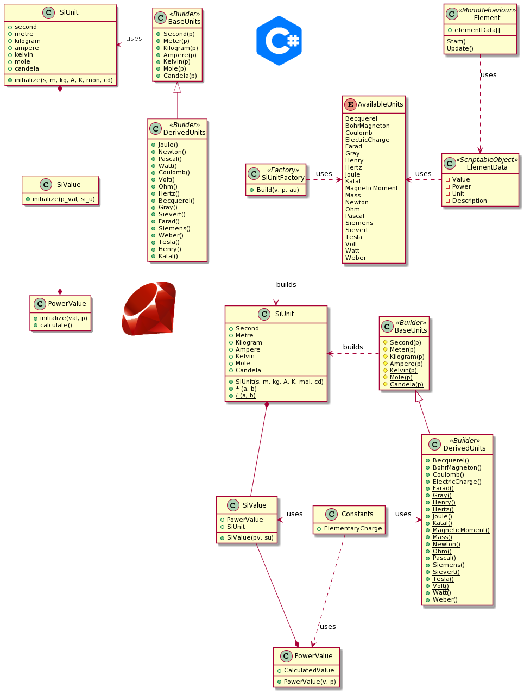

# SAM-simulator

A simulator of the structured atom model.

## Guidelines

* Documentation is done in [AsciiDoc](docs.asciidoctor.org/asciidoc/latest/syntax-quick-reference/) using [PlantUML](www.plantuml.com) for diagrams.
* 2019 LTS Version of Unity is used

## Project

* Place reqierements and issues in the [Project](https://github.com/MopcSolutions/structured-atom-model-simulator/projects/1)
* Discussion takes place in [discord](https://discord.gg/NKTX5ufP9p)

## Diagrams

Current diagrams

